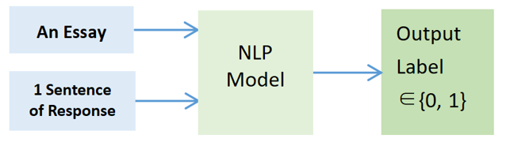
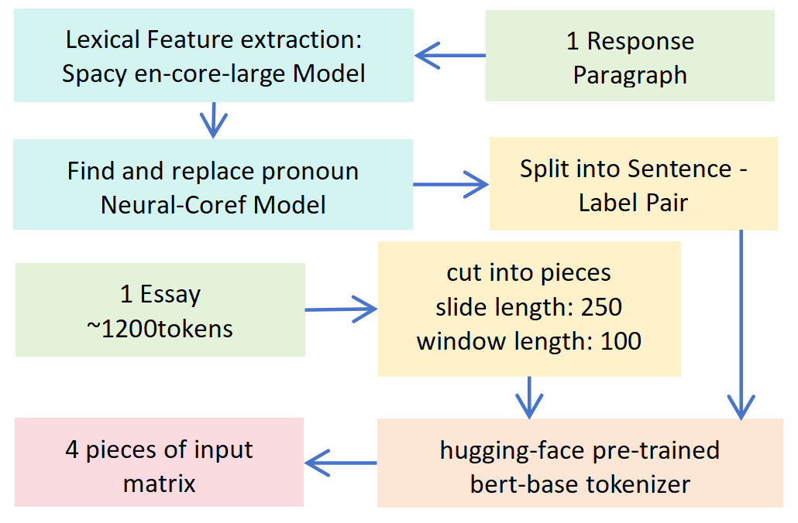
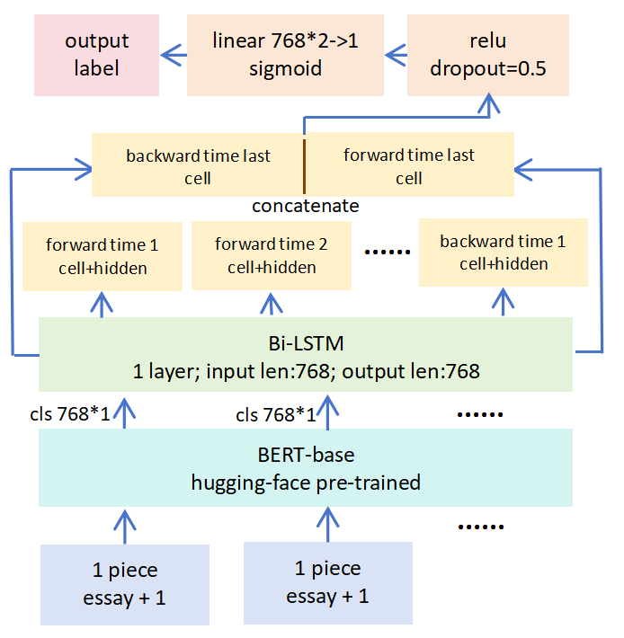
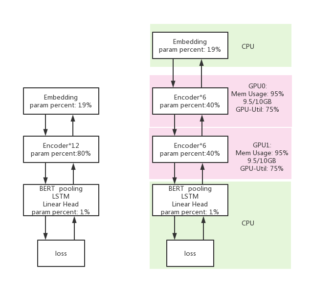
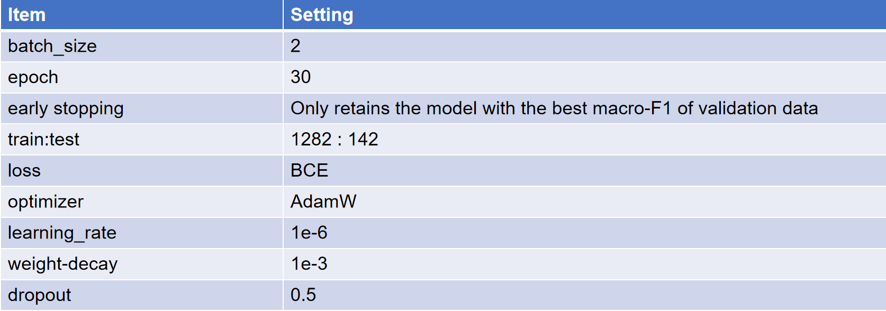
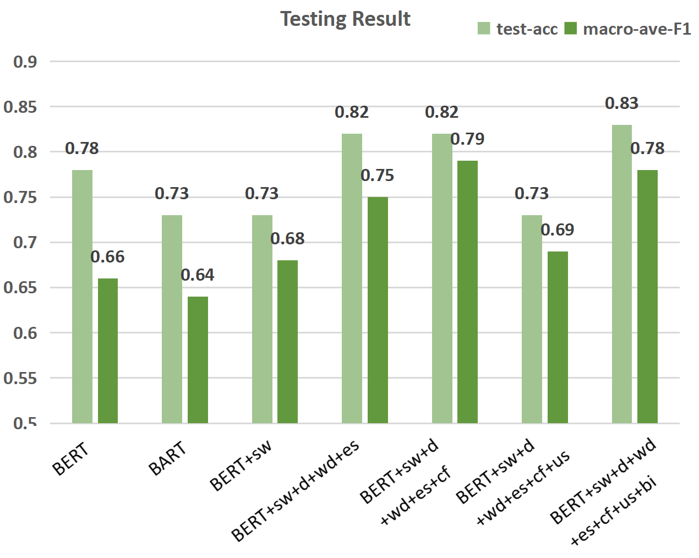

# Sliding-BERT: Assessing the Hallucination Possibility of An NLG Feedback Sentence #
This document is aimed at introducing the programme and explaining the source code.

- Introduction 
- Data Processing
- Model
- Training
- Results
- Future Directions & References

## 1. Introduction  ##

----------

The aim of the project is to adopt the classic Natural Language Interface (NLI) method to judge the factuality of a sentence from a feedback paragraph generated by NLG models, given the previous dialogue. The basic idea is to predict the **entailment possibility** of a feedback sentence generated by AI from an input paragraph.

The basic structure is:

Form of the data (**data.json**): 

- Essay: Some essays written by students;

- Response: The feedback paragraphs of judgement corresponding to each essay generated by an NLG model;

- Label: Each sentence generated of the response is labeled manually whether it is true(1) or false(0) according to the corresponding essay.

## 2. Data Processing  ##

----------
**data.py** includes all the data processing method needed. The way to load and save data as json format is:
> from data import data
> 
> d=data()
> 
> d.load_json(filename)
> 
> d.save_json(filename)

**Coreference Elimination**: As only one sentence of the reply is entered each time, the model does not know the preceding text. Therefore, It is impossible for the model to know what the pronouns and the other reference words mean, and it is predictable that when a pronouns is replaced with what it really means, the model would perform better. Here I used the pretrained Spacy large English model to extract lexical features from a whole paragraph of a response, and then input the extracted features into the pretrained neural-coref model to cluster the words with referential relationships. After that, only the high scored referential clusters were picked out, and the pronouns in them were replaced with the corresponding specific nouns.

This code was put in a new env, see directory “**coref**”.

As this method cannot replace the reference to a whole sentence, like “**......** This is a shame.” and “**......** For example, the explanation is not very detailed.”, so the whole sentence before such reference was re-added before the target sentence with a sentence reference, using:

> d.json_replace_this_example()

**data_cf_old2.json** is the file processed.

**Summirize or not**: Both the summrized essay and the one not summrized is tried as the input.
**data_cf.json** is the data file which eliminated the co-reference and used the un-summrized data.

**Sliding Window**: As there’s an input length limit for any NLP model, a long piece of text must be divided into many small segments --**slides**. Each slide will retain about 100 tokens of the front and back context. The latest version of programme now can generate the minimum number of slides determined by the text length. After sliding window generation, each slide of an essay with its one sentence of response is combined to be a piece of a whole input. The way to cut slide pieces and generate the model input file in torch format is

> d.load_json(filename) #load json file
> 
> d.sli_cf_generate()
> 
> d.save_win()
> 
> d.load_win()

The saved file is named “processed_data_win”

Here is the whole process.

## Model ##

----------
See **requirments.txt** for default environment setup.

To get pre-trained model: 

> git clone https://huggingface.co/bert-base-uncased

**bert3.py** defines the model and the training method.

All the methods of class **NNmanager**:

> from bert3 import *
> 
> n=NNmanager()
> 
> n.load()
> 
> n.train(epochs, train_data, validation_data=[]) #The method will automatically retains the model with the best macro-F1 of validation data
> 
> n.predlist(self,xlist)
> 
> n.predict(x)
> 
> n.save()

How to use the model:

> from data import data
> 
> from bert3 import *
> 
> d=data()
> 
> d.load_win()
> 
> n=NNmanager()
> 
> n.load()
> 
> n.train(epochs, d.model_input[:1282], d.model_input[1282:])
> 
> n.predlist(d.model_input[1282:])
> 
> n.predict(d.model_input[0])
> 
> n.save()

Or you can just use “main.py”  for training and testing in the backend of the linux system:

> nohup python main.py >log.out 2>&1 &

Here is the model structure.

**LSTM**: As the output sequence of cls vectors from the input slides still shows the order of original text pieces, I chose LSTM to integrate the output cls information pieces of the slides. Also, LSTM can enable variable length input, which means there is no longer input length limit. The last long time memory was chosen as the output and sent it into a linear layer to get the final label. 

**Bi-LSTM**: For un-summarized data, as the number of slide pieces becomes longer to 10 pieces, the LSTM gradually forgets the previous information, so the performance will deteriorate. Bi-LSTM can retain the previous memory.

**No necessity to ensure the same suquence length**: The new version of Pytorch enables the back-propogation of the outputs with different input lengths from LSTM, so there's no need to complement the lengths of the inputs with zeros in a batch, which results in significant computational savings.

## Training ##

----------
Computing resource requirement:

Model memory: ~5GB

model grad memory: ~5GB

data momory (data+computational graph): ~15GB (max data size: 11 sildes * 512 vector length; batch_size: 2)

total momory requirements: ~25GB

**Model Parallelism**: As 2 cheap GPUS with 10GB memory each were available, I used model parallelism to enable GPU acceleration. I suggest using model parallelism to fully utilize your computational resources. To enable this, I directly changed the source code of BERT in the transformers library. The changed code is in class **BertEncoder** in **modeling_bert.py**. Below shows the model parallelism setup:

**Training Parameters**: One thing I want to mention is the items about the prevention of overfitting. I used AdamW to enable weight decay, that is, L2 regularization, with dropout layer and early stopping. In fact, the model's fitting ability is so strong that the training set success rate can always converge to 100 percent. However, the validation set success rate usually reaches its peak at the training set success rate of 93%, so early stopping helps.

## Result ##

----------

Annotation: sw: sliding window; d: dropout; wd: weight-decay (that is, L2 regularization); es: early stopping; cf: coreference elimination; us: unsummarized essay (the trial before using summarized essay as input); bi: bi-LSTM.

## Directions for follow-up ##

----------
**Data Quality**: Some sentences are neutral, like suggestions and subjective judgments. These sentences will be given a score near 0.5 by our model. However, the labels in the dataset only include 0 and 1. If neutral sentences are labelled 0.5 manually in the dataset, not only will the testing result become better, but also the understanding ability of the model will be improved in the training process. 

**Combine GAT and IE with NLI models**: This method may enhance the text understanding ablility of our model. 

## Reference ##

----------
**NLI Hallucination Judgement**: arXiv:1904.03371

**BERT**: arXiv:1810.04805

**BERT pre-trained Model**: https://huggingface.co/docs/transformers/model_doc/bert

**Neural Coref**: https://github.com/huggingface/neuralcoref

**Sliding Window**: arXiv:1908.08167